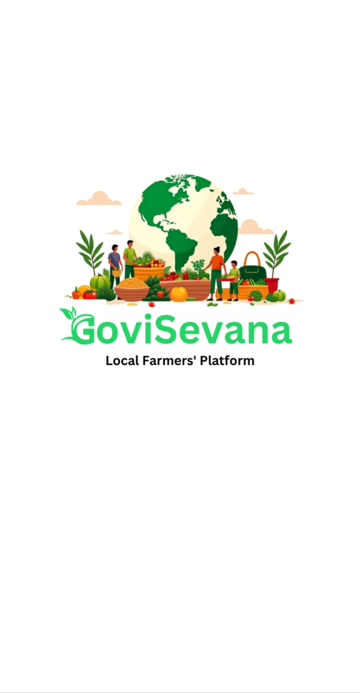
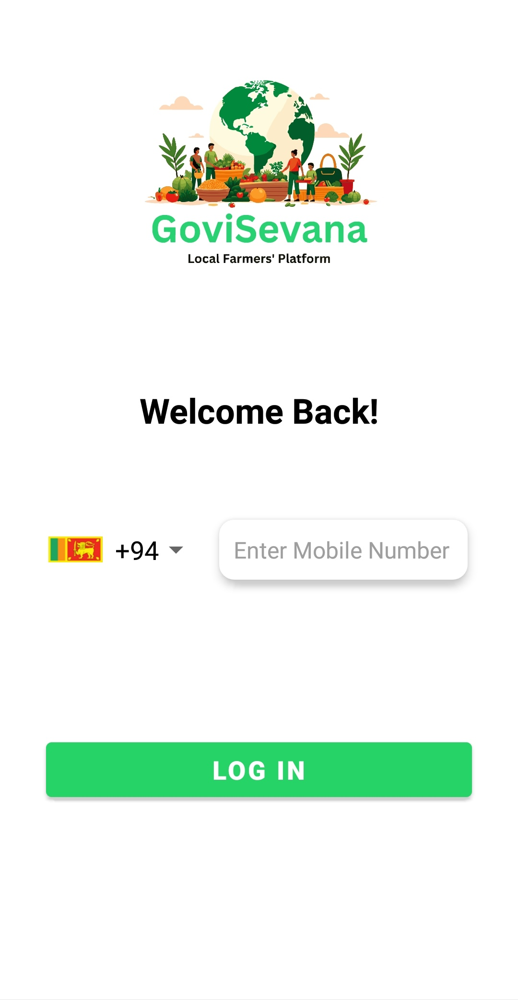

# Govi Sevana Admin Dashboard

The **Govi Sevana Admin Dashboard** is a specialized Android application designed for platform administrators to manage the ecosystem, oversee transactions, and ensure a smooth marketplace experience.

---

## 🛠️ Key Features

- **User Management**: Monitor and manage both Farmer and Buyer accounts.
- **Product Oversight**: Review, approve, or moderate agricultural product listings.
- **Order Tracking**: Keep track of all sales and deliveries across the platform.
- **System Settings**: Manage app-wide configurations and static content.
- **Secure Authentication**: OTP-based login system for authorized administrators.

---

## 🏗️ UI Showcase

| Admin Login | Admin Dashboard |
| :---: | :---: |
|  |  |

---

## 🛠️ Tech Stack

- **Frontend**: Native Android (Java)
- **Database**: Firebase Firestore
- **Authentication**: Firebase Auth (OTP)

---

## 🚀 Setup Instructions

1. Clone the repository.
2. Open the `GoviSevana_Admin` folder in Android Studio.
3. Add your `google-services.json` to the `app/` directory.
4. Build and deploy to an Android device.

---

© 2026 GoviSevana Platform
